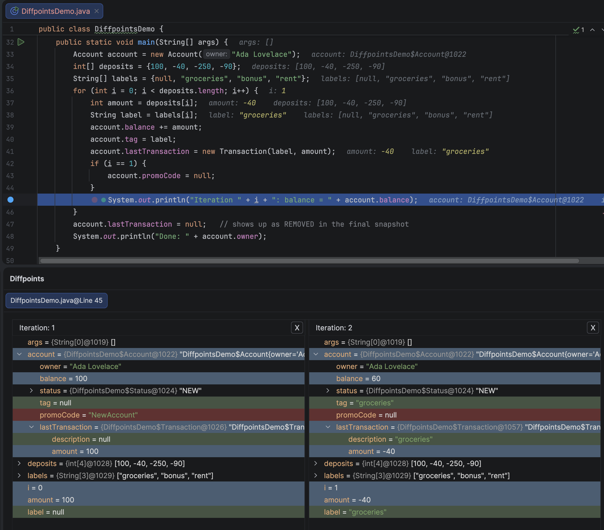
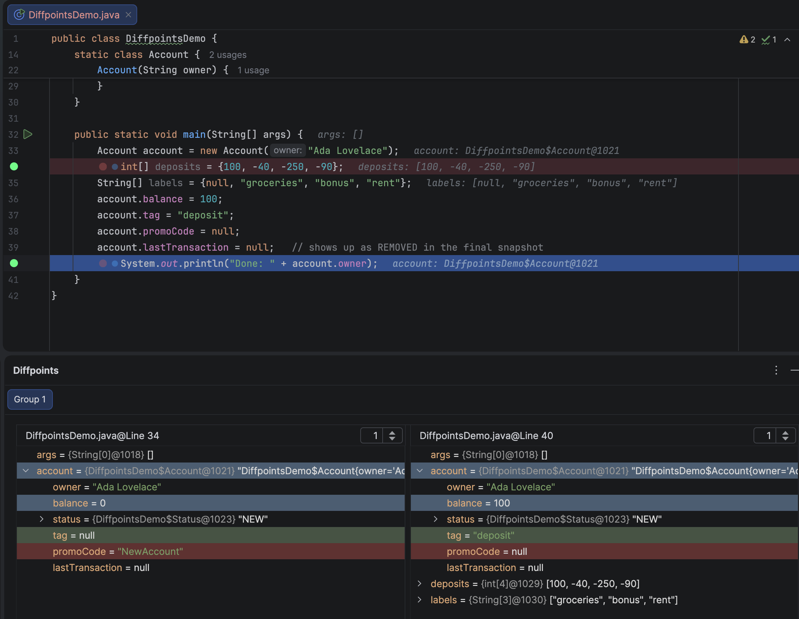
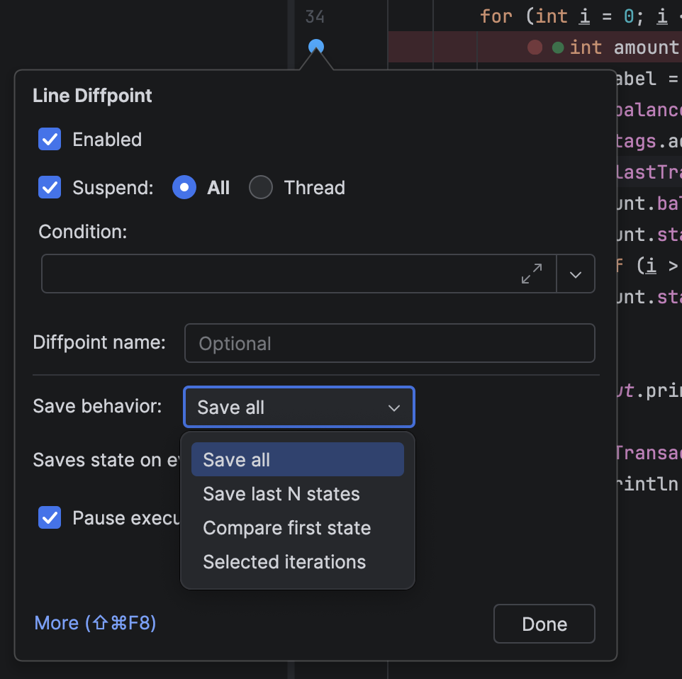
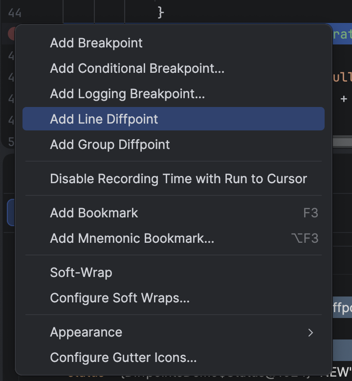
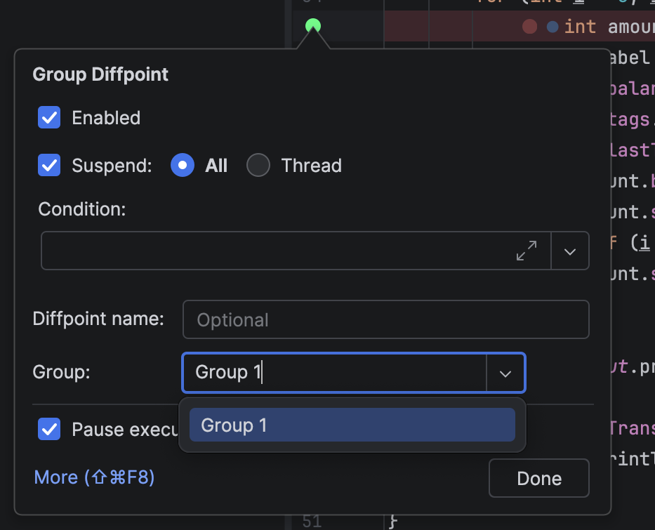

# Diffpoints

**Diffpoints** is an IntelliJ IDEA plugin that brings *diffing* to the debugger. A diffpoint captures
the state of your local variables at one or more points in execution and shows exactly how they changed, including all their fields and elements, in a color-coded, side-by-side tree view.

<a href="docs/diffpoints_tool_window.png"></a>

---

## Features

### Two kinds of diffpoints

- **Line Diffpoints**: capture variable state every time a line is hit and compare the snapshots
  against one another. Ideal for watching state evolve across loop iterations or repeated calls.
- **Group Diffpoints**: assign several diffpoints to a named group to compare state across
  *different* locations in your code, side by side.

<a href="docs/diffpoints_tool_window_group.png"></a>

### Capture modes (Line Diffpoints)

| Mode | Behavior |
| --- | --- |
| **Save all** | Captures a snapshot on every hit. |
| **Save last N states** | Keeps only the most recent *N* snapshots (2–25). |
| **Compare first state** | Compares every new snapshot against the first one captured. |
| **Selected iterations** | Captures only on specific hit numbers (e.g. `1, 3, 4, 5`). |

<a href="docs/line_settings.png"></a>

### Visual comparison

Snapshots are rendered as synchronized, side-by-side trees with linked scrolling, and differences
are color-coded (unchanged / changed / added / removed). A separate comparison panel lets you pin
and compare individual variables you select.

### Non-intrusive

Each diffpoint can pause execution on every hit like a normal breakpoint, or run silently,
collecting snapshots in the background without stopping the program.

### Quick toggling

Add or remove diffpoints from the editor gutter's breakpoint context menu.

<a href="docs/gutter_context_menu.png"></a>

---

## Installation

Simply [download the latest release](https://github.com/sulir/diffpoints/releases/download/v1.5.4/Diffpoints-1.5.4.zip) and install it via **Settings → Plugins → ⚙ → Install Plugin from Disk…** and select the downloaded ZIP file.

---

## Usage

1. **Place a diffpoint.** Right-click the editor gutter and choose **Add Line Diffpoint** or
   **Add Group Diffpoint**.
2. **Configure it.** Open its properties to set a name, capture mode, whether it pauses execution,
   and (for group diffpoints) its group.

   <a href="docs/group_setting.png"></a>

3. **Open the Diffpoints tool window** through View -> Tool windows -> Diffpoints.
4. **Debug your program** as usual.
5. **Inspect the diff.** In the **Diffpoints** tool window, each diffpoint or group gets a tab showing
   its snapshots side by side, with differences highlighted.

You can also remove an unnecessary column by clicking "x". To compare manually selected objects, select "+ add to compare" from their context menu and then click "Show comparison panel".

---

## Development

Diffpoints uses Gradle as a build system. To launch a sandbox IDE with the plugin pre-installed, run:

```bash
git clone https://github.com/sulir/diffpoints.git
cd diffpoints
./gradlew runIde
```

A binary version of the plugin can be built with `./gradlew buildPlugin`.

---

## License

Licensed under the [Apache License 2.0](LICENSE.txt). Developed at the
[Technical University of Košice (TUKE)](https://www.tuke.sk).
